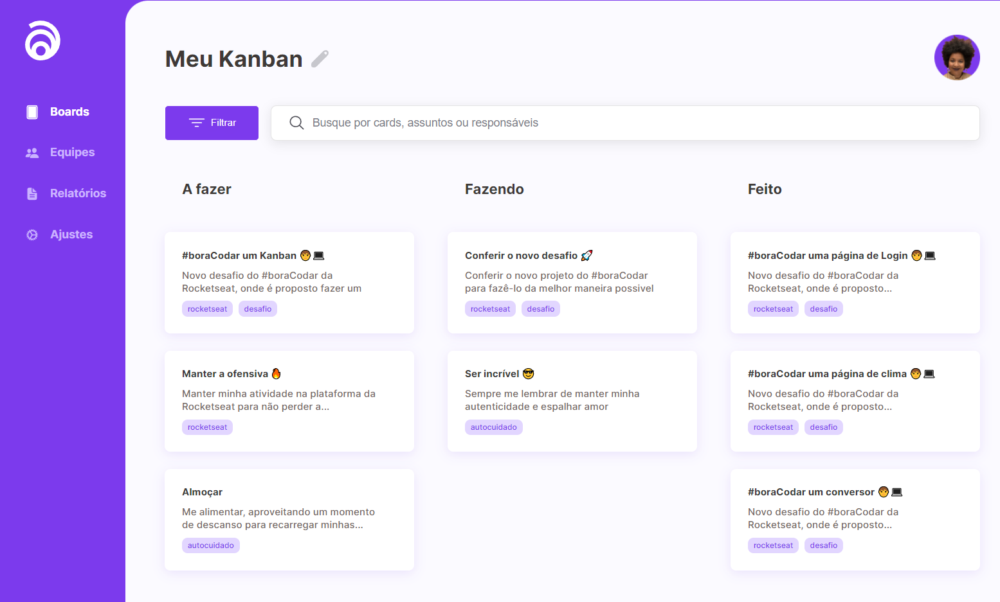
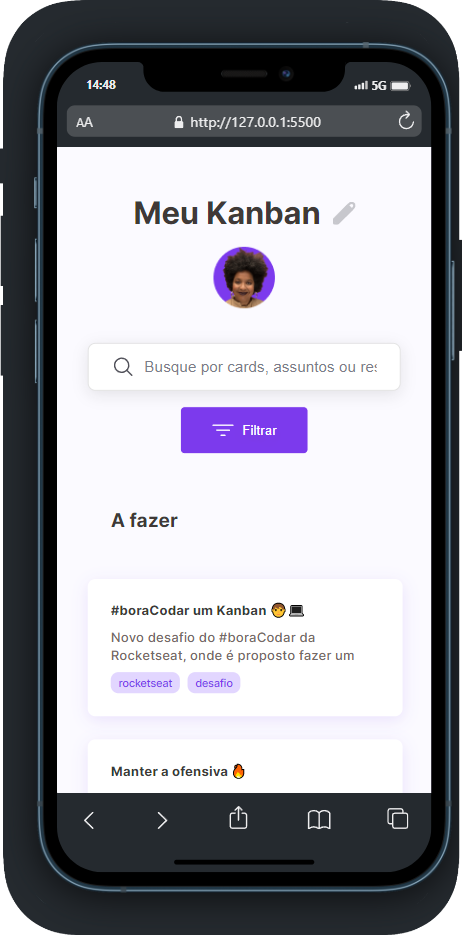

<h1 align="center"> Kanban </h1>

  <a href="#-tecnologias">Tecnologias</a>&nbsp;&nbsp;&nbsp;|&nbsp;&nbsp;&nbsp;
  <a href="#-projeto">Projeto</a>&nbsp;&nbsp;&nbsp;|&nbsp;&nbsp;&nbsp;
  <a href="#-layout">Layout</a>&nbsp;&nbsp;&nbsp;|&nbsp;&nbsp;&nbsp;
  <a href="#memo-licença">Licença</a>

  

  

 

## 🚀 Tecnologias

Esse projeto foi desenvolvido com as seguintes tecnologias:

- HTML
- SCSS
- Javascript

## 💻 Projeto

Kanban desenvolvido no #boraCodar da Rocketseat, totalmente responsivo e com o evento de arrastar funcionando

## 🚧 Features

- Filtrar os cards
- Criar novas tarefas

## 🔖 Layout

Você pode visualizar o layout do projeto através [DESSE LINK](https://www.figma.com/community/file/1220368226816658013/%23boracodar---Desafio-12). É necessário ter conta no [Figma](https://figma.com) para acessá-lo

## :memo: Licença

Esse projeto está sob a licença MIT.

---
